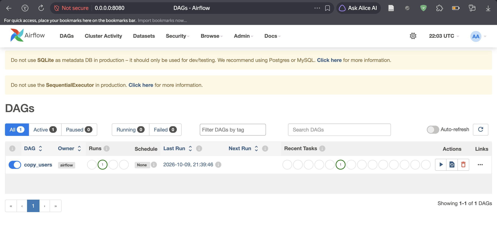
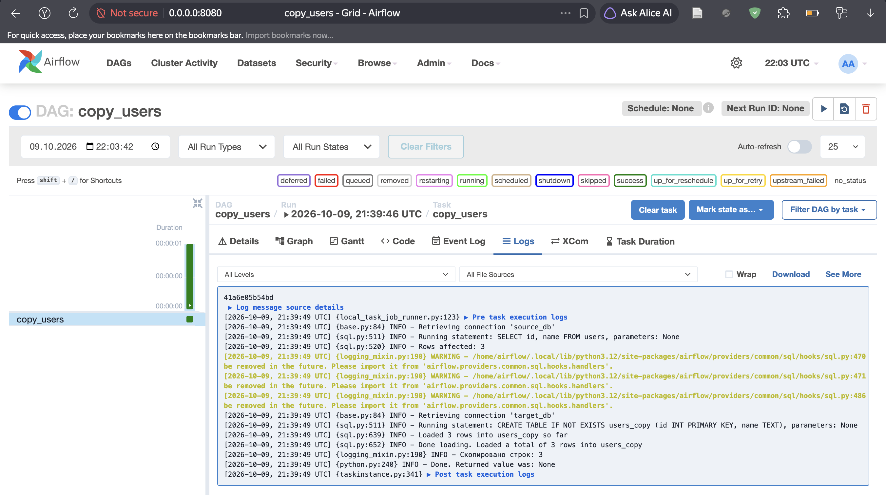
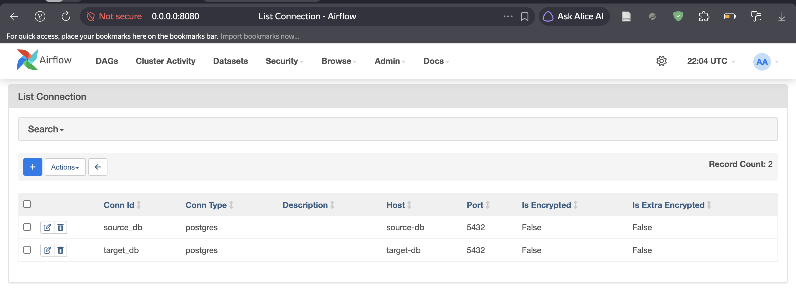
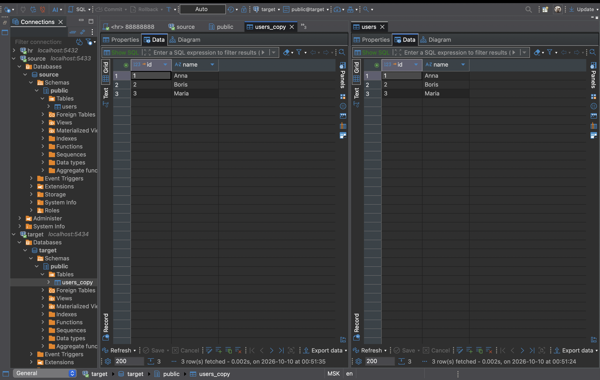
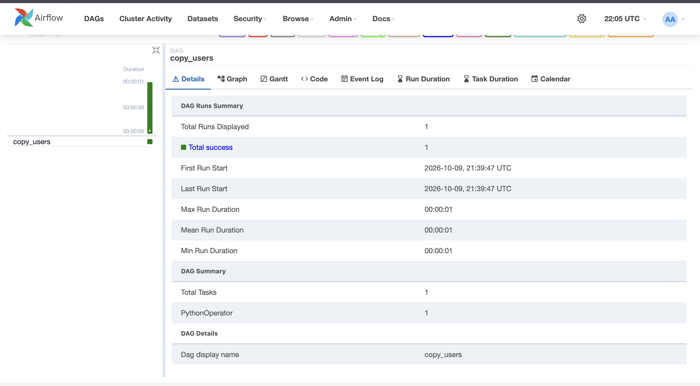

### Пара скриптов, которые создают мне две бд на постгресс + Apache Airflow для того, чтобы скопировать данные из одной бд в другую

# Apache Airflow

Apache Airflow — это инструмент для автоматизации рабочих процессов и задач с данными. Он позволяет создавать цепочки задач, задавать расписание, следить за их выполнением и управлять зависимостями между этапами.

Airflow подходит для ETL/ELT, пакетной обработки данных, интеграций между сервисами и регулярных задач в продакшене.

Простыми словами, ETL/ELT — это процесс, когда данные берутся из разных источников (например, из базы данных, CRM, файлов, API), приводятся в нужный вид, очищаются и загружаются в хранилище или систему для анализа. Схема такая: Extract (получить) → Transform (преобразовать) → Load (загрузить). Например, из заказов в интернет-магазине, логов сайта и данных из 1С можно собрать единый набор данных для отчётов и аналитики.

Пакетная обработка данных — это запуск задач по расписанию, когда данные обрабатываются большими порциями, а не в реальном времени. Интеграции между сервисами — это автоматическое обмена данными между системами, например, когда после оплаты заказа данные отправляются в CRM, ERP и почтовую рассылку.

